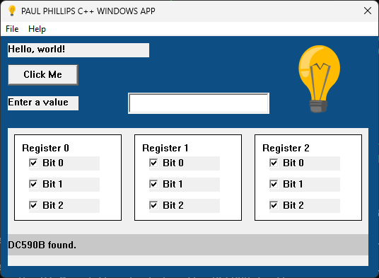

# CPP-Windows-Desktop-Application

This is an example of a C++ Windows Desktop Application. The purpose of it is to represent a simple Applications Engineering test program inspired by Analog Devices' LTpowerPlay.

The top portion shows how to add Labels, Buttons, TextBoxes, and Images.

The bottom portion shows a collection of registers, one for each register on an integrated circuit.

This is by no means a completed application.

